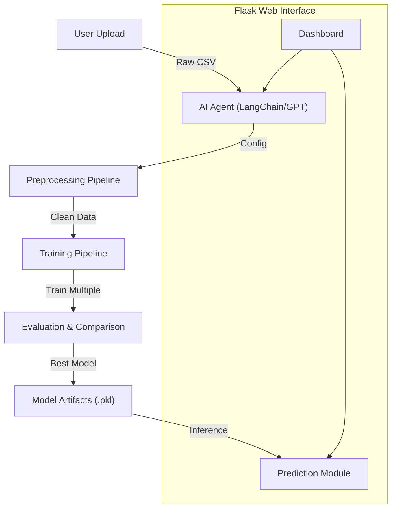

# 🤖 AutoML with AI Agent

**An Autonomous Machine Learning Pipeline with a Modern Glassmorphism UI**

This project automates the end-to-end Machine Learning workflow—from data ingestion and analysis to model deployment—using **LLM-powered AI Agents** (LangChain + OpenAI) and a robust **Flask** backend.

---

## 🌟 Key Features

### 🧠 Intelligent Analysis (AI Agent)
- **Automatic Insight**: Uses **OpenAI GPT-4o** to analyze dataset structure.
- **Smart Decision Making**: Automatically determines the **Target Column**, **Problem Type** (Classification vs. Regression), and optimal **Models** to train.
- **Resilient Logic**: Fallback heuristics ensure continuity even if the API is unavailable.

### ⚙️ Robust Preprocessing Pipeline
- **Missing Value Imputation**: Automatically fills missing data (Mean for numeric, Mode for categorical).
- **Feature Encoding**: Handles categorical variables using `LabelEncoder`.
- **Scaling**: Standardizes features using `StandardScaler` for optimal model performance.

### 🏋️‍♂️ Multi-Model Training & Evaluation
- **Classification**: Logistic Regression, Decision Tree, Random Forest, SVM.
- **Regression**: Linear Regression, Random Forest, Gradient Boosting, SVR.
- **Performance Visualization**: Generates and displays model comparison plots (Accuracy/RMSE).
- **Best Model Selection**: Automatically saves the highest-performing model for inference.

### 💻 Modern Web Interface
- **Glassmorphism Design**: A sleek, user-friendly dashboard built with Bootstrap 5 and custom CSS.
- **Progress Tracking**: Real-time status indicators for Data, Model, and Prediction stages.
- **Downloadable Artifacts**: Easy access to preprocessed data, trained models, and prediction results.

---

## 🏗 System Architecture



---

## 🛠 Tech Stack

- **Core**: Python 3.11
- **AI & LLM**: LangChain, OpenAI API
- **Web Framework**: Flask (Jinja2 Templates)
- **ML Libraries**: Scikit-learn, Pandas, NumPy, Joblib
- **Visualization**: Matplotlib
- **Frontend**: HTML5, Bootstrap 5, Custom CSS (Glassmorphism)

---

## 📂 Project Structure

```bash
AutoML-using-AI-Agents/
│
├── app/
│ ├── static/
│ │ ├── css/
│ │ │ └── glass.css       # Custom Glassmorphism styles
│ │ └── accuracy_plot.png # Generated performance plot
│ ├── templates/
│ │ ├── base.html         # Base layout with Navbar
│ │ └── index.html        # Main Dashboard
│ ├── ai_agent.py         # LLM logic (LangChain)
│ ├── app.py              # Flask server & Routes
│ ├── pipeline.py         # Core utilities
│ ├── preprocess_pipeline.py
│ ├── train_pipeline.py
│ └── predict_pipeline.py
│
├── data/                 # Data storage (Raw, Processed, Outputs)
├── .env                  # Environment variables (OpenAI Key)
├── requirements.txt
└── README.md
```

---

## 🚀 Getting Started

### 1. Clone the Repository
```bash
git clone https://github.com/your-username/AutoML-with-AI-Agent.git
cd AutoML-with-AI-Agent
```

### 2. Set Up Virtual Environment
```bash
python -m venv venv
# Windows
venv\Scripts\activate
# Mac/Linux
source venv/bin/activate
```

### 3. Install Dependencies
```bash
pip install -r requirements.txt
```

### 4. Configure Environment
Create a `.env` file in the root directory and add your OpenAI API Key:
```ini
OPENAI_API_KEY=sk-your-openai-api-key-here
# Optional: Model selection
OPENAI_MODEL=gpt-4o-mini
```

### 5. Run the Application
```bash
python app/app.py
```
> Access the dashboard at: **http://127.0.0.1:5000**

---

## � How to Use

1.  **Upload Dataset**: Select your raw CSV file on the dashboard.
2.  **Run AutoML**: Click "Run AutoML". The AI Agent will analyze the data, preprocess it, and train the best model.
3.  **View Results**: Check the training logs and model accuracy graph.
4.  **Predict**: Upload a new dataset (without the target column) to generate predictions.
5.  **Download**: Save the clean data or prediction results for offline use.

---

📅 Current Progress
| Module                      | Status         |
| --------------------------- | -------------- |
| Data Preprocessing          | ✅ Completed    |
| Model Training & Evaluation | ✅ Completed    |
| Prediction Module           | ✅ Completed    |
| AI Agent Integration        | ✅ Completed    |
| Flask UI                    | ✅ Completed    |